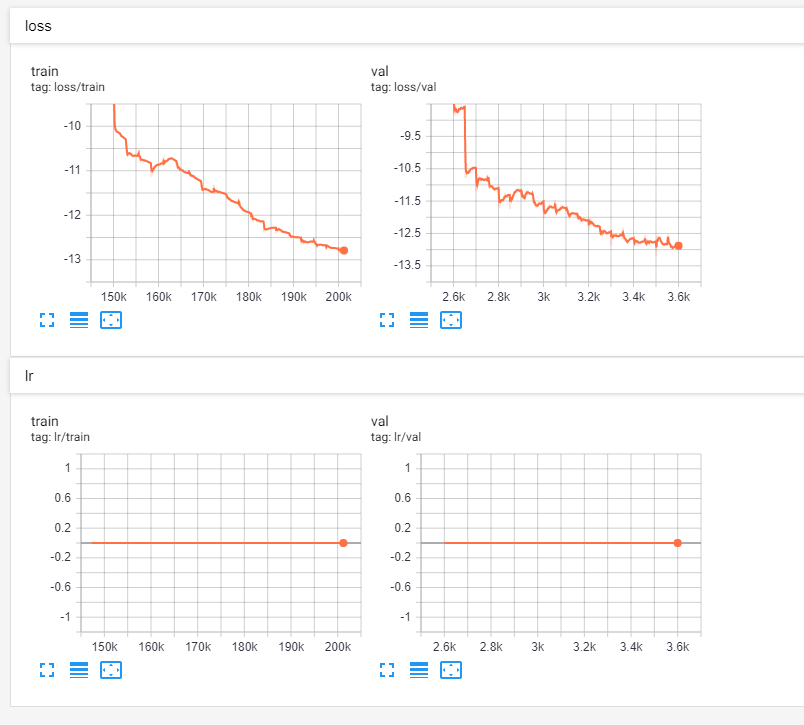
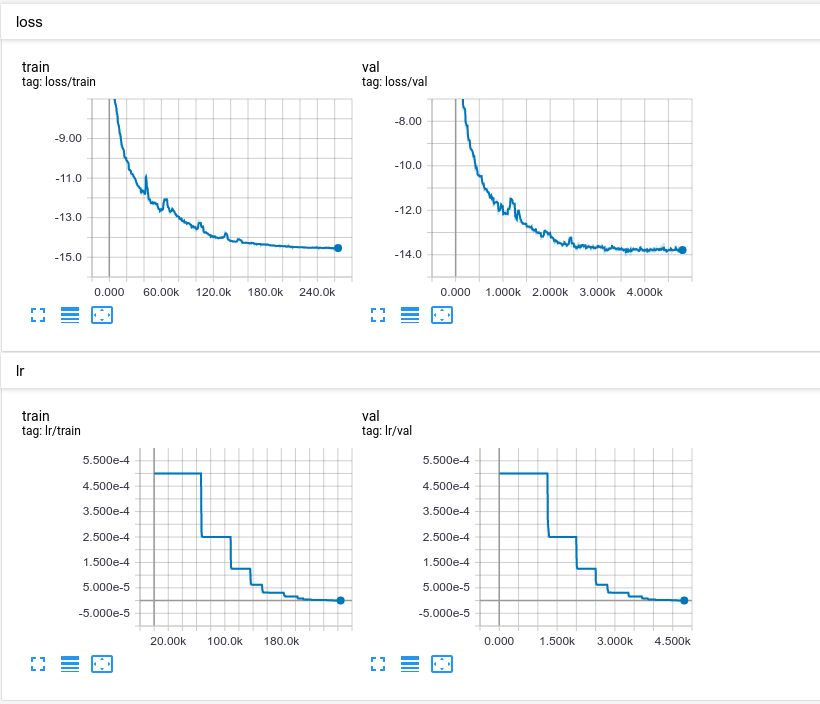

# TIME-DOMAIN-AUDIO-VISUAL-SPEECH-SEPARATION
Pytorch implementation

***
**View results:**

***

| Model type  | Clean audio val loss | 
| ----------- | -------------------- |
| Audio-only       | 12.88                |
| AudioVisual | 13.85                |

(*higher* is better)

***

### Audio-only model
* #### Clean audio 
[tensorboard log online](https://tensorboard.dev/experiment/PXy5m20DR0aAb5fvqEjofA/)

***

### AudioVisual model
* #### Clean audio
[tensorboard log online](https://tensorboard.dev/experiment/Buna7CXiRqyWkGo9Z1exrQ)

